# Raport L2

Adrian Mucha

## Zad 1
a) Obecność powtórzeń nie ma wpływu na wartośc estymacji. Powtórzenia wygenerują ten sam hasz, w związku z czym jeżeli takowy już istnieje w zbiore **M** to zostanie odrzucony i nie wpłynie na stan zbioru **M**. W skrajnym przypadku gdy ilość powtórzeń będzie mniejsza od parametru **k** otrzymamy przypadek w którym dostaniemy dokładną wartość.

b) Wykresy przedstawiające eksperymenty. Na osi pionowej mamy stosunek **n̂/n** a na osi poziomej **n**.

<small>NOTE: click to expand</small>
<details>
    <summary>MD5 (128bit)</summary>

### MD5
- k=2 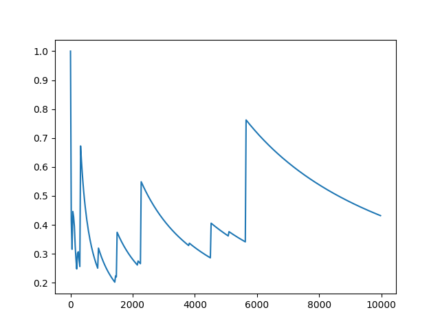
- k=3 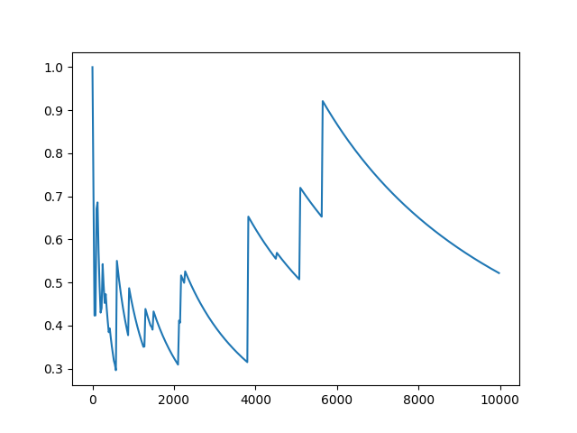
- k=10 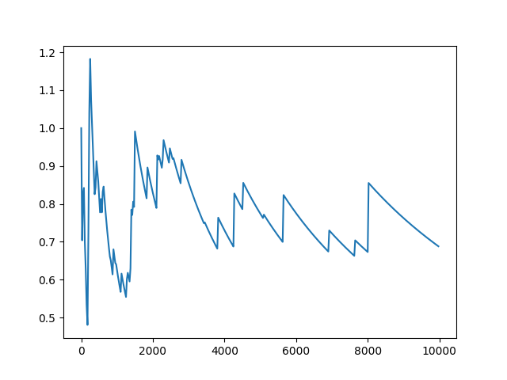
- k=100 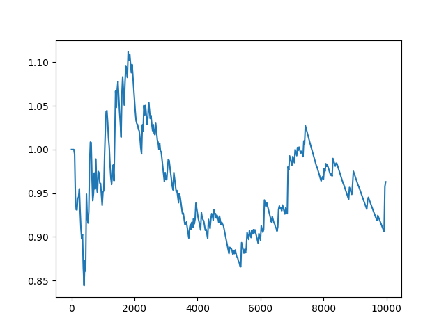
- k=400 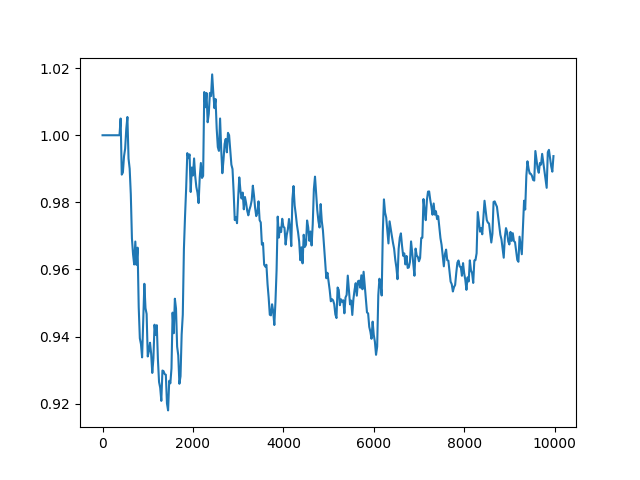
</details>

<details>
    <summary>SHA1 (160bit)</summary>

### SHA1
- k=2 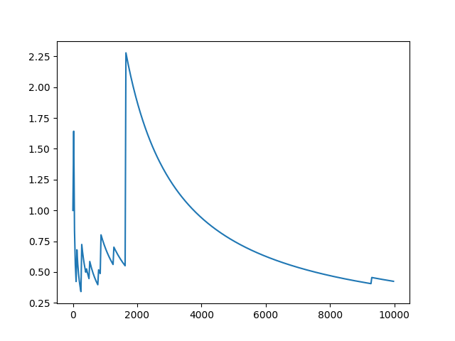
- k=3 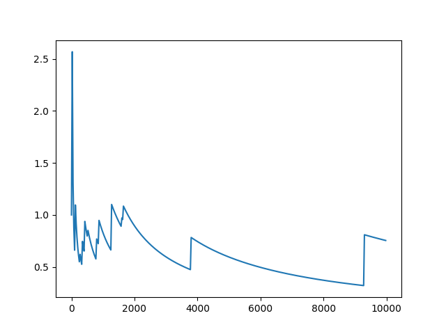
- k=10 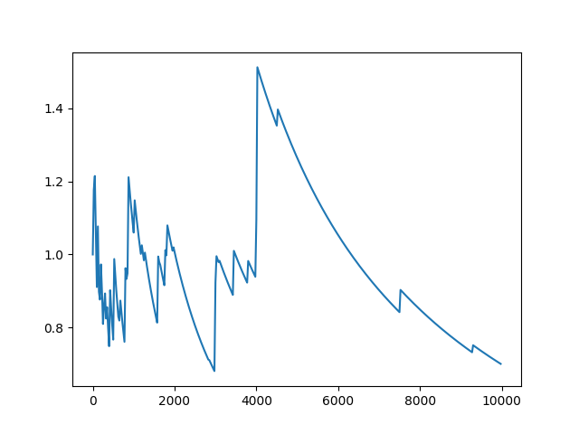
- k=100 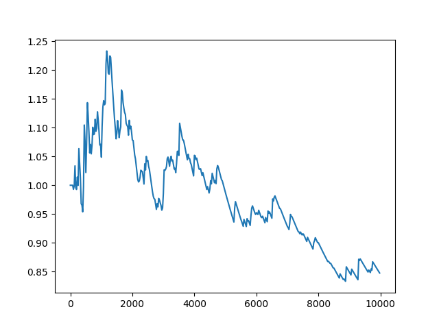
- k=400 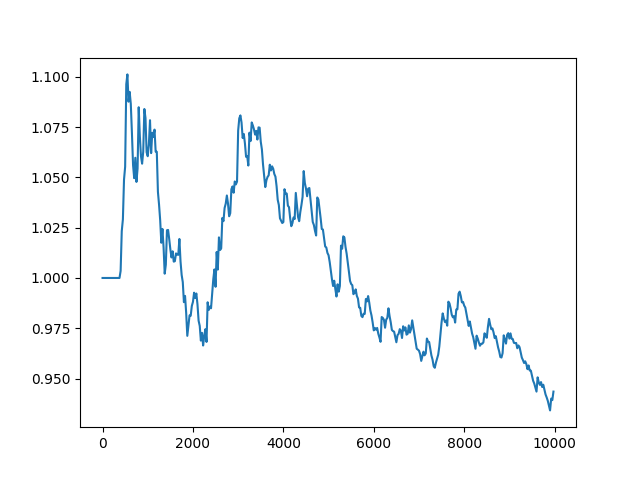
</details>

<details>
    <summary>SHA3-224 (224bit)</summary>

### SHA3-224
- k=2 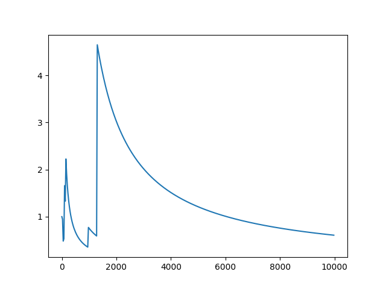
- k=3 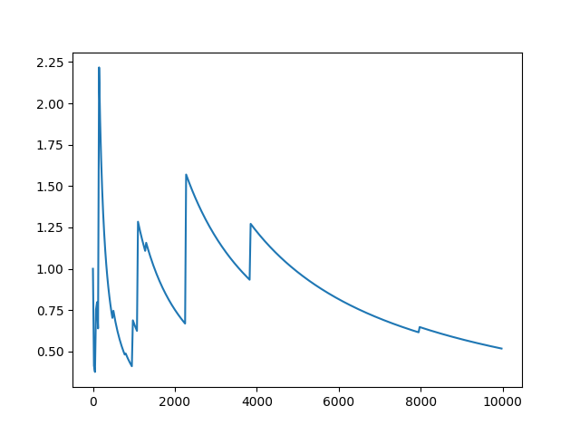
- k=10 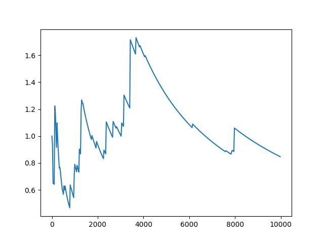
- k=100 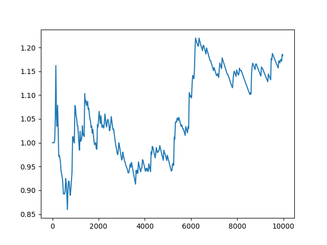
- k=400 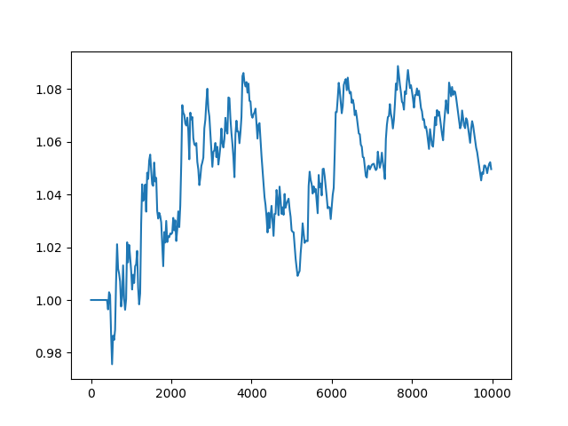
</details>

<details>
    <summary>SHA256 (256bit)</summary>

### SHA256
- k=2 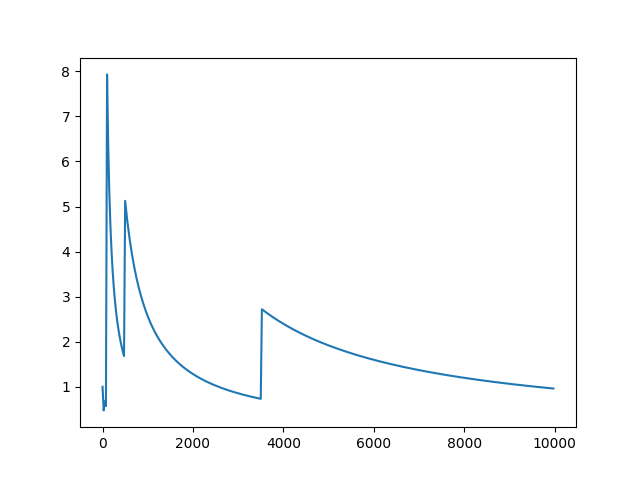
- k=3 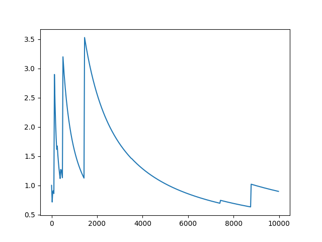
- k=10 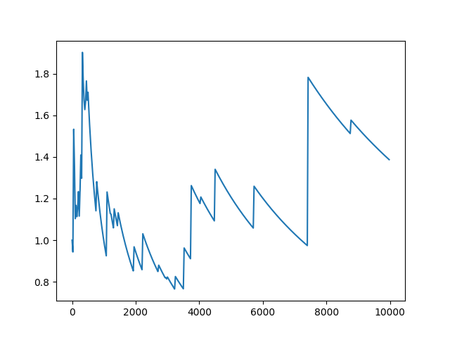
- k=100 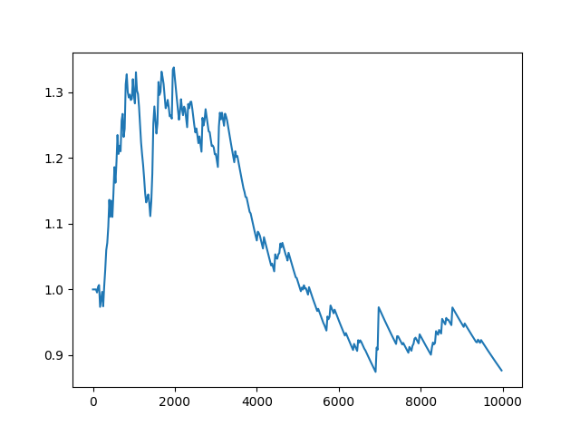
- k=400 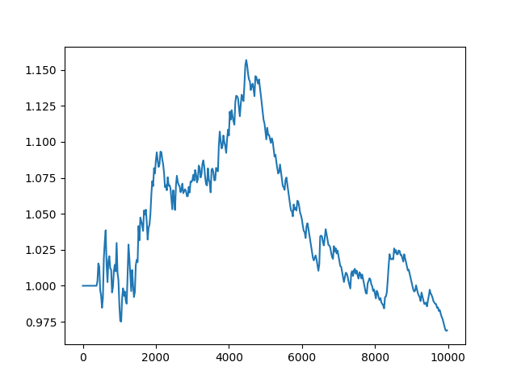
</details>

c) Wybór najlepszego parametru **k** drogą eksperymentów, dał następujące wyniki z użyciem funkcji hashującej **md5**:

**n = 10000**
```
# k = 100 | Success rate of error rate +-10%: 0.8924
# k = 125 | Success rate of error rate +-10%: 0.9406 <<
# k = 137 | Success rate of error rate +-10%: 0.9275 !!!
# k = 150 | Success rate of error rate +-10%: 0.9787 <<
# k = 175 | Success rate of error rate +-10%: 0.9812
# k = 200 | Success rate of error rate +-10%: 0.9805
# k = 225 | Success rate of error rate +-10%: 0.9891
# k = 250 | Success rate of error rate +-10%: 0.9829
# k = 275 | Success rate of error rate +-10%: 0.9994
# k = 300 | Success rate of error rate +-10%: 0.9998
```
**n = 1000**
```
# k = 151 | Success rate of error rate +-10%: 0.857
# k = 201 | Success rate of error rate +-10%: 0.811
# k = 251 | Success rate of error rate +-10%: 0.951 <<
# k = 255 | Success rate of error rate +-10%: 0.967
# k = 276 | Success rate of error rate +-10%: 0.997
```