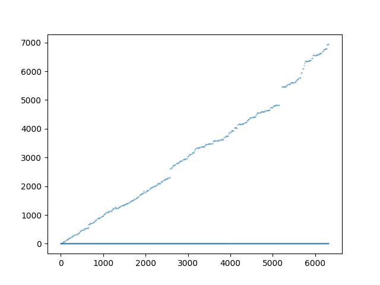

# Raport L2

Adrian Mucha

## Zad 5

a) Obecność powtórzeń faktycznie ma znaczenie gdy chcemy oszacować liczność całego zbioru. W momencie gdy trafiamy na tę samą wartość, generowany jest identyczny hash, przez co "tracimy informację" o jego wystąpieniu. Jeżeli takowy już istnieje w zbiorze **M** to zostanie odrzucony i nie wpłynie na stan zbioru **M**. W skrajnym przypadku gdy ilość powtórzeń będzie mniejsza od parametru **k** otrzymamy przypadek w którym dostaniemy dokładną wartość. **Nie wpływa to jednak na szacowanie liczby unikalnych wartości** (pomijając kolizje hashy).

b) Wykresy przedstawiające eksperymenty. Na osi pionowej mamy stosunek **n̂/n** a na osi poziomej **n**.

<small>NOTE: click to expand</small>

<details>
    <summary>MD5 (128bit)</summary>

### MD5

- k=2 
- k=3 
- k=10 
- k=100 
- k=400 
  </details>

<details>
    <summary>SHA1 (160bit)</summary>

### SHA1

- k=2 
- k=3 
- k=10 
- k=100 
- k=400 
  </details>

<details>
    <summary>SHA2 (256bit)</summary>

### SHA2

- k=2 
- k=3 
- k=10 
- k=100 
- k=400 
  </details>

<details>
    <summary>SHA3 (224bit)</summary>

### SHA3

- k=2 
- k=3 
- k=10 
- k=100 
- k=400 
  </details>

c) Wybór najlepszego parametru **k** drogą eksperymentów, dał następujące wyniki z użyciem funkcji hashującej **md5**:

TYLKO UNIKALNE ELEMENTY
**n = 10000**  
Dla 10000 prób wystarczy dobrać `k = 150` aby wyniki nie odbiegały od prawdziwej wartości o ±10% w 95% przypadków. W szczególności prawdopodobnie istnieje `125 < k < 150`, takie że spełnia ten warunek i jest najmniejszym k na tym przedziale.

```
# k = 100 | Success rate of error rate ±10%: 0.8924
# k = 125 | Success rate of error rate ±10%: 0.9406 <<
# k = 137 | Success rate of error rate ±10%: 0.9275 !!!
# k = 150 | Success rate of error rate ±10%: 0.9787 <<
# k = 175 | Success rate of error rate ±10%: 0.9812
# k = 200 | Success rate of error rate ±10%: 0.9805
# k = 225 | Success rate of error rate ±10%: 0.9891
# k = 250 | Success rate of error rate ±10%: 0.9829
# k = 275 | Success rate of error rate ±10%: 0.9994
# k = 300 | Success rate of error rate ±10%: 0.9998
```

**n = 1000**

```
# k = 151 | Success rate of error rate ±10%: 0.857
# k = 201 | Success rate of error rate ±10%: 0.811
# k = 251 | Success rate of error rate ±10%: 0.951 <<
# k = 255 | Success rate of error rate ±10%: 0.967
# k = 276 | Success rate of error rate ±10%: 0.997
```

LOSOWE (**n = 10000** elementów, ok 6500 unikalnych):

```
k = 200	| Precision (-10% < x < +10%): 0.8147
k = 250	| Precision (-10% < x < +10%): 0.9083
k = 260	| Precision (-10% < x < +10%): 0.9559 <<
k = 275	| Precision (-10% < x < +10%): 0.9999
```

W ogólności, dla multizbiorów z powtarzającymi się elementami wystarczy dobrać **k= 260** by w 95% przypadków otrzymać wynik o błędzie względnym ±10%.

## Zad 6

`b` oznacza ilość bitów do których został obicięty hash  
`k = 400`  
`n = 100000`  
NOTE: Dla algorytmów mających krótsze hashe wybieramy `min(b, hash.max_len)`.

```
============================b=8============================
     md5 | n̂=255	            | n=100000	| err=99.74%
    sha1 | n̂=255	            | n=100000	| err=99.74%
sha3_224 | n̂=255	            | n=100000	| err=99.74%
  sha256 | n̂=255	            | n=100000	| err=99.74%
============================b=16============================
     md5 | n̂=51779.13861386138	| n=100000	| err=48.22%
    sha1 | n̂=50971.666666666664	| n=100000	| err=49.03%
sha3_224 | n̂=54475.96875	    | n=100000	| err=45.52%
  sha256 | n̂=51985.01988071571	| n=100000	| err=48.01%
============================b=24============================
     md5 | n̂=107799.10439949758	| n=100000	| err=7.80%
    sha1 | n̂=101174.48741007195	| n=100000	| err=1.17%
sha3_224 | n̂=99672.55974449457	| n=100000	| err=0.33%
  sha256 | n̂=103226.09115021049	| n=100000	| err=3.23%
============================b=32============================
     md5 | n̂=107798.71749966944	| n=100000	| err=7.80%
    sha1 | n̂=101175.31772959797	| n=100000	| err=1.18%
sha3_224 | n̂=99922.79085339198	| n=100000	| err=0.08%
  sha256 | n̂=104750.42061767158	| n=100000	| err=4.75%

.
.
.

============================b=256============================
     md5 | n̂=107798.71457918668	| n=100000	| err=7.80%
    sha1 | n̂=101175.31354223097	| n=100000	| err=1.18%
sha3_224 | n̂=99922.78567801436	| n=100000	| err=0.08%
  sha256 | n̂=104750.41479821435	| n=100000	| err=4.75%

```

## Zad 7

Na wykresach przedstawiono na osi pionowej wartości `n̂`, a na osi poziomej wartości `n`. Linie pomarańczowe oraz zielone oznaczają ograniczenia postawione przez nierówności Czebyszewa oraz Chernoffa.

`k = 400`  
`n = 10000`


Na wykresach widzimy, że wyniki teoretyczne pokrywają się z tymi uzyskanymi z eksperymentów i koncentrują się w ograniczeniach postawionych przez nierówności.

## Zad 8

### Success rate | Precision (-10% < x < +10%) within 95%

Użyta funkcja: **md5**

```
b = 4 | Precision (-10% < x < +10%): 0.2454
b = 5	| Precision (-10% < x < +10%): 0.3883
b = 8 | Precision (-10% < x < +10%): 0.9086
b = 12| Precision (-10% < x < +10%): 1.0
b = 16| Precision (-10% < x < +10%): 1.0
```

### Wykresy

Wykresy przedstawiające eksperymenty. Na osi pionowej mamy stosunek **n̂/n** a na osi poziomej **n**.

**b = 4**


**b = 8**



**b = 12**


**b = 16**


### Porównanie błędów względnych
Wygląda na to, że średnio **MinCount** radzi sobie lepiej.
Zsumowane błędy względne a następnie je uśredniono. Otrzymano następujące wyniki:
| algorytm    | uśredniony błąd |
| ----------- | --------------- |
| HyperLogLog | 11.73%          |
| MinCount    | 2.14%           |
