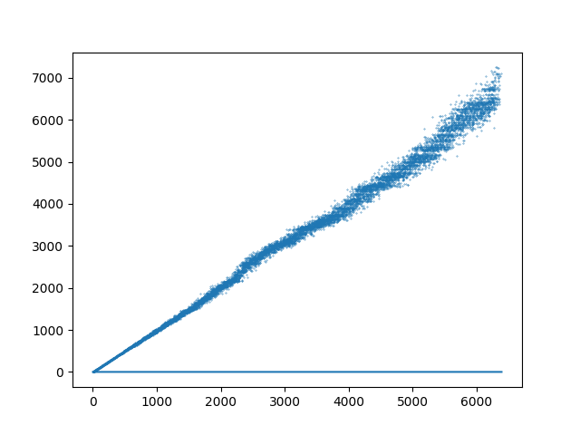
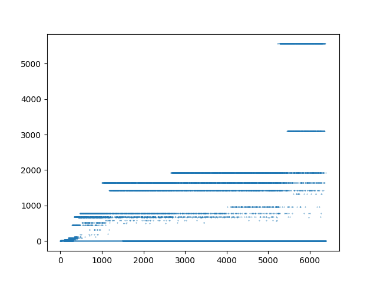
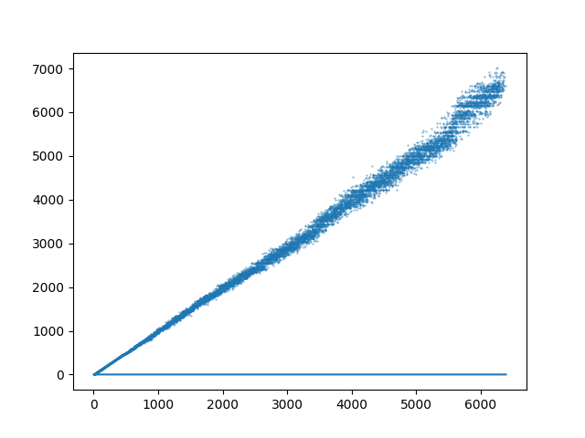
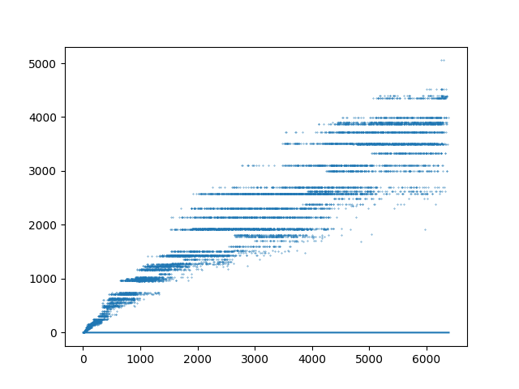
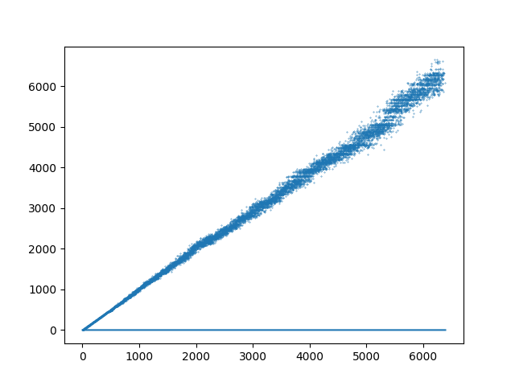
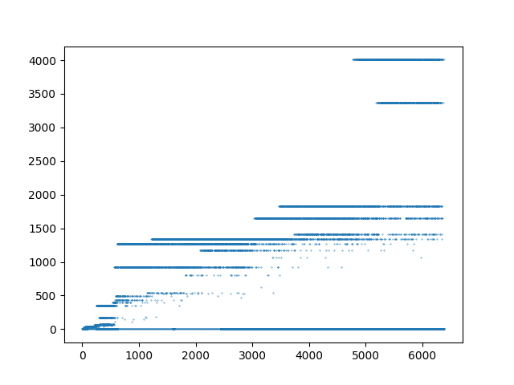

# Raport L2

Adrian Mucha

## Zad 5

a) Powtórzenia nie mają znaczenia, gdyż algorytm służy tylko oszacowaniu wartości unikalnych. W momencie gdy trafiamy na tę samą wartość, generowany jest identyczny hash. Jeżeli takowy już istnieje w zbiorze **M** to zostanie odrzucony i nie wpłynie na stan zbioru **M**.
Jedyne co wpływa na szacowanie liczby unikalnych wartości są kolizje hashy gdy więcej niż jedna wartość produkuje ten sam hash - wtedy szacowania tracą na dokładności.

b) Wykresy przedstawiające eksperymenty. Na osi pionowej mamy stosunek **n̂/n** a na osi poziomej **n**.

<small>NOTE: click to expand</small>

<details>
    <summary>MD5 (128bit)</summary>

### MD5

- k=2 
- k=3 
- k=10 
- k=100 
- k=400 

</details>

<details>
    <summary>SHA1 (160bit)</summary>

### SHA1

- k=2 
- k=3 
- k=10 
- k=100 
- k=400 

</details>

<details>
    <summary>SHA2 (256bit)</summary>

### SHA2

- k=2 
- k=3 
- k=10 
- k=100 
- k=400 

</details>

<details>
    <summary>SHA3 (224bit)</summary>

### SHA3

- k=2 
- k=3 
- k=10 
- k=100 
- k=400 

</details>

c) Wybór najlepszego parametru **k** drogą eksperymentów, dał następujące wyniki z użyciem funkcji hashującej **md5**:

LOSOWE (**n = 10000** elementów, ok 6500 unikalnych):
Dla 10000 prób wystarczy dobrać `k = 285` aby wyniki nie odbiegały od prawdziwej wartości o ±10% w 95% przypadków.

```
k = 260	| Precision (-10% < x < +10%): 0.909
k = 280	| Precision (-10% < x < +10%): 0.9465
k = 285	| Precision (-10% < x < +10%): 0.9551 <<
k = 300	| Precision (-10% < x < +10%): 0.9701
```

## Zad 6

Poniżej znajdują się wyniki szacowania liczby unikalnych elementów gdy dodatkowo obetniemy bity funkcji hashującej. Porównano iteracje różniące się 8 bitami (1 bajtem). Możemy zauważyć, że dla 8 bitów błąd jest prawie 100%, co świadczy o dużej liczbie kolizji hashy. Stopniowo gdy zwiększamy ilość bitów, błąd zmniejsza się i to bardzo szybko. Wystarczy użyć dwóch bajtów by zredukować ten błąd do 36%. Dodanie kolejnych 8 bitów powoduje osiągnięcie pewnej granicy błędu dla każdej z czterech funkcji hashujących. Możemy z tego wywnioskować, że jest to wystarczająca długość hasha aby zminimalizować ilość jego kolizji dla `n = 100000`.

`b` oznacza ilość bitów do których został obicięty hash  
`k = 400`  
`n = 100000`  
NOTE: Dla algorytmów mających krótsze hashe wybieramy `min(b, hash.max_len)`.

```
============================b=8============================
     md5 | n̂=255	            | n=63291	| err=99.60%
    sha1 | n̂=255	            | n=63291	| err=99.60%
sha3_224 | n̂=255	            | n=63291	| err=99.60%
  sha256 | n̂=255	            | n=63291	| err=99.60%
============================b=16============================
     md5 | n̂=40290.392912172574	| n=63291	| err=36.34%
    sha1 | n̂=41837.543999999994	| n=63291	| err=33.90%
sha3_224 | n̂=40290.392912172574	| n=63291	| err=36.34%
  sha256 | n̂=41308.79146919431	| n=63291	| err=34.73%
============================b=24============================
     md5 | n̂=65439.896621502725	| n=63291	| err=3.40%
    sha1 | n̂=66299.31052412646	| n=63291	| err=4.75%
sha3_224 | n̂=56763.408674637496	| n=63291	| err=10.31%
  sha256 | n̂=65202.781690140844	| n=63291	| err=3.02%
============================b=32============================
     md5 | n̂=65451.2700728324	| n=63291	| err=3.41%
    sha1 | n̂=66461.15402364318	| n=63291	| err=5.01%
sha3_224 | n̂=56763.353758619836	| n=63291	| err=10.31%
  sha256 | n̂=65202.299319453276	| n=63291	| err=3.02%

.
.
.

============================b=256============================
     md5 | n̂=65451.2700728324	| n=63291	| err=3.41%
    sha1 | n̂=66461.15402364318	| n=63291	| err=5.01%
sha3_224 | n̂=56763.353758619836	| n=63291	| err=10.31%
  sha256 | n̂=65202.299319453276	| n=63291	| err=3.02%

```

Spodziewałem się, że funkcja hashująca md5 będzie miała dużą ilość kolizji, natomiast z wyników przedstawionych wyżej, poradziła sobie jako jedna z lepszych. W teorii jest tak, że funkcje posiadające kolizje powinny dawać gorsze wyniki.

## Zad 7

Na wykresach przedstawiono na osi pionowej wartości `n̂`, a na osi poziomej wartości `n`. Linie pomarańczowe oraz zielone oznaczają ograniczenia postawione przez nierówności Czebyszewa oraz Chernoffa.

Aby przystąpić to analizy konentracji estymatora i nanieść ograniczenia na wykres obliczono `δ_1` oraz `δ_2` reprezentujące kolejno deltę z nierówności Czebyszewa oraz Chernoffa.

Linie na wykresie to wartości `n - nδ` oraz `n + nδ`. Ograniczenia te mówią o tym, że wyniki powinny znajdować się pomiędzy dwiema nierównościami. W szczególności nierówność Chernoffa (linia niebieska) bardzo dobrze szacuje te wyniki.

### Nierówność Czebyszewa


### Nierówność Chernoffa


`k = 400`  
`n = 10000`


Na wykresach widzimy, że wyniki teoretyczne pokrywają się z tymi uzyskanymi z eksperymentów i koncentrują się w ograniczeniach postawionych przez nierówności.

## Zad 8
Poniższa tabela przedstawia wyniki HyperLogLog dla `n = 10000` gdy użyjemy `b` bitów (`m = 2^b`). Użyty algorytm haszowania: `md5`.

```
b = 4	| Precision (-10% < x < +10%):  0.3057
b = 5	| Precision (-10% < x < +10%):  0.4684
b = 8	| Precision (-10% < x < +10%):  0.9242
b = 12  | Precision (-10% < x < +10%):  1.0
b = 16  | Precision (-10% < x < +10%):  1.0
```

### Wykresy
Wykresy przedstawiające eksperymenty. Na osi pionowej mamy estymację **n̂** a na osi poziomej **n**.

**b = 4**  


**b = 8**  


**b = 12**  


**b = 16**  


### Porównanie błędów względnych

**MinCount**  
`md5`  
`k = 400`, `n = 10000`,  
`b = 32`

**HyperLogLog**  
`md5`  
`n = 10000`, `b = 5`, `m = 32`

Zsumowane błędy względne a następnie je uśredniono. Otrzymano następujące wyniki:
| algorytm | uśredniony błąd |
| ----------- | --------------- |
| HyperLogLog | 12.23% |
| MinCount | 2.76% |

Najprawdopodobniej źle przeprowadzam obcinanie bitów na algorytmie MinCount, przez co nie wpływa to na jego precyzję. Nie potrafię obcinać bitów na typie `float` w pythonie. Natomiast porównując wykresy

**MinCount**  
`md5`  
`k = 400`, `n = 10000`,  
`b = 128`

**HyperLogLog**  
`md5`  
`n = 10000`, `m = 4096`

#### MinCount

#### HyperLogLog


Możemy śmiało powiedzieć, że w ogólności, HyperLogLog daje lepsze wyniki, bardziej dokładne. Ma lepszą koncentrację swojego estymatora.
